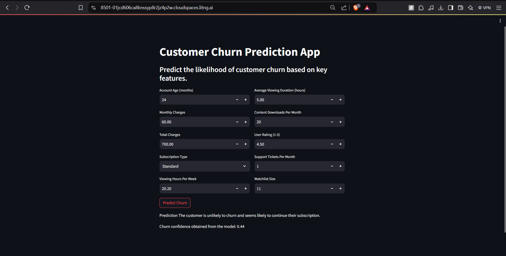

# Customer Churn Prediction with LightGBM 📉

This repository provides a complete machine learning workflow to predict **customer churn**, enabling businesses to identify at-risk customers early and design targeted retention strategies.  

The solution is built on a **LightGBM model** integrated within a custom data pipeline. It addresses class imbalance using **SMOTE**, applies feature engineering for improved accuracy, and includes an easy-to-use **Streamlit application** for real-time churn prediction.

This project demonstrates practical skills in **data preprocessing, model optimization, and deployment**, showcasing the ability to deliver end-to-end ML solutions that drive business impact.

---

## Web Application 🖥️

  
*Interactive Streamlit dashboard for making churn predictions based on user inputs.*

---

## Workflow 🛠️

1. **Preprocessing & Feature Engineering**  
   - Engineered new variables (e.g., `CustomerTenureEngagement`, `ContentConsumptionScore`) to strengthen predictive power.  
   - Applied ordinal and one-hot encoding for categorical features.  
   - Reduced skewness and outliers using transformations (log scaling, Winsorization).  

2. **Model Development**  
   - Implemented **LightGBM** for its scalability and efficiency on tabular data.  
   - Balanced classes with **SMOTE**, boosting recall for churn cases.  
   - Tuned hyperparameters with grid search to maximize recall and F1 score.  

3. **Deployment**  
   - Saved both preprocessing pipeline and model as `.pkl` files for reproducibility.  
   - Built a **Streamlit web app** where users can input customer data and receive churn probability instantly.  

---

## Run the Streamlit Application 🚀

### Step 1: Clone the Repository
```bash
git clone https://github.com/varun199520/churn-predictor.git
cd churn-predictor
```

### Step 2: Set Up Environment and Install Dependencies
```bash
python -m venv venv
source venv/bin/activate  # For Linux/MacOS
venv\Scripts\activate  # For Windows
pip install -r requirements.txt
```

### Step 3: Download Model and Pipeline Files
Download the following files and place them in the project root:

- smote_lgbm.pkl: The pre-trained LightGBM model.
- preprocessing_pipeline.pkl: The custom preprocessing pipeline.
These files are be provided as part of the repository assets.

### Step 4: Run the Streamlit App
Start the Streamlit application by running:
```bash
streamlit run app.py
```
This will open the application in your web browser
